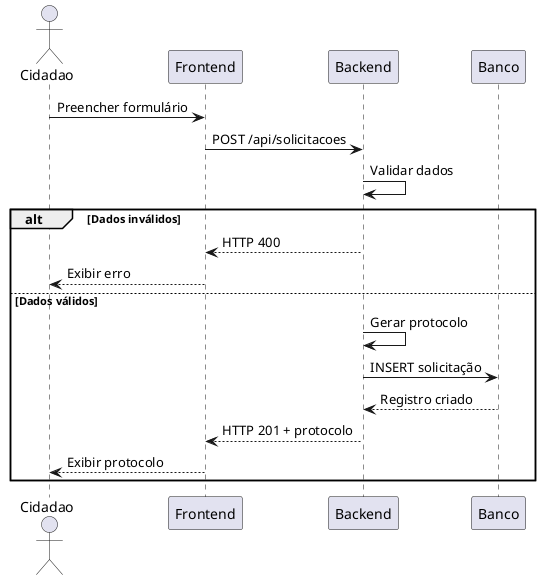
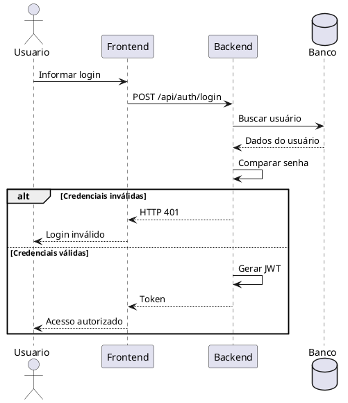
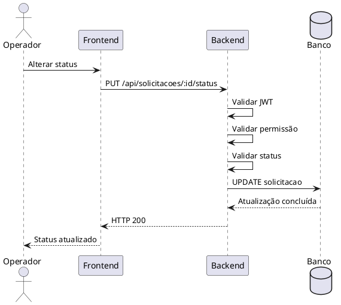
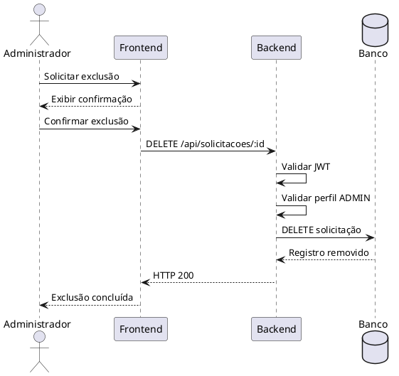
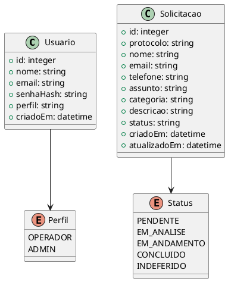

# Especificação de Requisitos de Sistema (ERS)

## Plataforma Integrada de Gestão de Atendimentos

**Versão:** 1.0.0
**Data:** 08 de setembro de 2026
**Base:** ISO/IEC/IEEE 29148:2018
**Modelagem:** UML 2.5.1

---

# 1. Introdução

## 1.1 Objetivo

Este documento especifica os requisitos funcionais e não funcionais da **Plataforma Integrada de Gestão de Atendimentos**.

A Especificação de Requisitos de Sistema (ERS) descreve os comportamentos, restrições, interfaces, regras de negócio, requisitos de segurança, desempenho e persistência necessários para a implementação da plataforma.

---

## 1.2 Escopo do Sistema

A plataforma será responsável pelo gerenciamento de solicitações de atendimento, permitindo que cidadãos realizem solicitações e acompanhem seus protocolos, enquanto operadores e administradores poderão gerenciar os atendimentos através de uma área administrativa.

O sistema deverá disponibilizar:

* Formulário público de solicitações;
* Geração automática de protocolos;
* Consulta de solicitações;
* Autenticação administrativa;
* Controle de acesso;
* Gerenciamento dos atendimentos;
* Alteração de status;
* Exclusão segura de registros;
* Persistência em banco de dados;
* API REST;
* Validação de dados;
* Mecanismos de segurança;
* Interface web responsiva.

---

# 2. Arquitetura do Sistema

A plataforma será organizada em três camadas principais:

```text
┌─────────────────────────────────────────────┐
│                  FRONTEND                   │
│        HTML5 + CSS3 + JavaScript            │
└──────────────────────┬──────────────────────┘
                       │ HTTP/REST
                       ▼
┌─────────────────────────────────────────────┐
│                  BACKEND                    │
│              Node.js + Express              │
│                                             │
│  Rotas │ Controllers │ Middleware │ Auth    │
└──────────────────────┬──────────────────────┘
                       │
                       ▼
┌─────────────────────────────────────────────┐
│                 BANCO DE DADOS              │
│              SQLite / PostgreSQL             │
└─────────────────────────────────────────────┘
```

---

# 3. Requisitos Funcionais

## RSF-01 — Cadastro público de solicitação

O sistema deverá disponibilizar um endpoint público para criação de solicitações.

### Endpoint

```http
POST /api/solicitacoes
```

### Dados esperados

```json
{
  "nome": "Nome do cidadão",
  "email": "usuario@email.com",
  "telefone": "(00) 00000-0000",
  "assunto": "Assunto da solicitação",
  "categoria": "Categoria",
  "descricao": "Descrição da solicitação"
}
```

### Regras

1. O endpoint deverá aceitar requisições HTTP POST.
2. Os campos obrigatórios deverão ser validados.
3. Dados inválidos deverão gerar resposta de erro.
4. O sistema deverá gerar um protocolo único.
5. O status inicial deverá ser `PENDENTE`.
6. A solicitação deverá ser armazenada no banco.
7. O sistema deverá retornar os dados necessários para acompanhamento.

---

# 4. RSF-02 — Autenticação

O sistema deverá disponibilizar autenticação para operadores e administradores.

### Endpoint

```http
POST /api/auth/login
```

### Dados de entrada

```json
{
  "email": "admin@email.com",
  "senha": "senha"
}
```

### Resposta esperada

```json
{
  "token": "JWT_TOKEN",
  "usuario": {
    "id": 1,
    "nome": "Administrador",
    "email": "admin@email.com",
    "perfil": "ADMIN"
  }
}
```

### Regras

1. O sistema deverá validar o usuário.
2. A senha deverá ser comparada de forma segura.
3. O sistema deverá gerar um token JWT após autenticação válida.
4. Credenciais inválidas deverão retornar erro.
5. Recursos protegidos deverão exigir token válido.
6. O token deverá possuir tempo de expiração.
7. O perfil do usuário deverá determinar suas permissões.

---

# 5. RSF-03 — Consulta de solicitações

O sistema deverá permitir a consulta de solicitações através do protocolo.

### Endpoint

```http
GET /api/solicitacoes/:protocolo
```

### Regras

1. O protocolo deverá ser informado.
2. O sistema deverá localizar a solicitação correspondente.
3. Caso o protocolo não exista, deverá retornar erro apropriado.
4. A consulta deverá apresentar o status atual.
5. Informações sensíveis não deverão ser expostas desnecessariamente.

### Exemplo

```json
{
  "protocolo": "2026-000001",
  "status": "EM_ANALISE",
  "assunto": "Solicitação de atendimento"
}
```

---

# 6. RSF-04 — Listagem administrativa

Usuários autenticados e autorizados deverão poder visualizar as solicitações cadastradas.

### Endpoint

```http
GET /api/solicitacoes
```

### Funcionalidades

O sistema deverá permitir:

* Listar solicitações;
* Consultar por protocolo;
* Filtrar por status;
* Filtrar por categoria;
* Ordenar resultados;
* Utilizar paginação.

### Exemplo

```http
GET /api/solicitacoes?status=PENDENTE&page=1&limit=20
```

---

# 7. RSF-05 — Visualização detalhada

O sistema deverá permitir que usuários administrativos visualizem os dados completos de uma solicitação.

### Endpoint

```http
GET /api/solicitacoes/:id
```

### Regras

1. O usuário deverá estar autenticado.
2. O sistema deverá verificar as permissões.
3. A solicitação deverá existir.
4. Os dados deverão ser retornados de forma estruturada.

---

# 8. RSF-06 — Alteração de status

O sistema deverá permitir a alteração do status de uma solicitação por usuários autorizados.

### Endpoint

```http
PUT /api/solicitacoes/:id/status
```

### Dados

```json
{
  "status": "EM_ANDAMENTO"
}
```

### Status permitidos

```text
PENDENTE
EM_ANALISE
EM_ANDAMENTO
CONCLUIDO
INDEFERIDO
```

### Regras

1. O usuário deverá estar autenticado.
2. O usuário deverá possuir permissão.
3. O status informado deverá ser válido.
4. O sistema deverá atualizar o registro.
5. A alteração deverá ser persistida.
6. O novo status deverá estar disponível para consulta.

---

# 9. RSF-07 — Exclusão de solicitação

O sistema deverá permitir a exclusão de solicitações somente para administradores autorizados.

### Endpoint

```http
DELETE /api/solicitacoes/:id
```

### Regras

1. O usuário deverá estar autenticado.
2. O usuário deverá possuir perfil administrativo.
3. O sistema deverá validar a existência do registro.
4. A interface deverá exigir confirmação antes da operação.
5. O backend deverá validar novamente a autorização.
6. Após a confirmação, o registro deverá ser removido.
7. A operação deverá retornar uma resposta apropriada.

---

# 10. RSF-08 — Geração de protocolo

O sistema deverá gerar automaticamente um protocolo único para cada solicitação.

### Requisitos

O protocolo deverá:

* Ser único;
* Permitir identificação da solicitação;
* Ser armazenado no banco;
* Ser retornado ao cidadão após o cadastro;
* Permitir consulta posterior.

### Exemplo

```text
2026-000001
2026-000002
2026-000003
```

---

# 11. RSF-09 — Controle de permissões

O sistema deverá possuir controle de acesso baseado no perfil do usuário.

### Perfis

| Perfil   | Permissões                               |
| -------- | ---------------------------------------- |
| OPERADOR | Visualizar solicitações e alterar status |
| ADMIN    | Todas as permissões administrativas      |
| CIDADÃO  | Registrar e consultar solicitações       |

### Regras

O backend deverá impedir que um usuário execute operações que não estejam autorizadas para seu perfil.

---

# 12. RSF-10 — Validação de dados

Todos os dados recebidos pelo backend deverão ser validados.

O sistema deverá validar:

* Campos obrigatórios;
* Formato de e-mail;
* Tamanho dos campos;
* Valores permitidos;
* Identificadores;
* Status;
* Tipos de dados.

Dados inválidos deverão gerar respostas HTTP adequadas.

---

# 13. Requisitos de Banco de Dados

## 13.1 Persistência

O sistema deverá utilizar banco de dados relacional.

As opções previstas são:

* SQLite para desenvolvimento;
* PostgreSQL para ambientes de produção.

---

## 13.2 Tabela de usuários

Estrutura mínima:

```sql
CREATE TABLE usuarios (
    id INTEGER PRIMARY KEY AUTOINCREMENT,
    nome VARCHAR(150) NOT NULL,
    email VARCHAR(150) NOT NULL UNIQUE,
    senha_hash TEXT NOT NULL,
    perfil VARCHAR(30) NOT NULL,
    criado_em DATETIME DEFAULT CURRENT_TIMESTAMP
);
```

---

## 13.3 Tabela de solicitações

```sql
CREATE TABLE solicitacoes (
    id INTEGER PRIMARY KEY AUTOINCREMENT,
    protocolo VARCHAR(50) NOT NULL UNIQUE,
    nome VARCHAR(150) NOT NULL,
    email VARCHAR(150) NOT NULL,
    telefone VARCHAR(30),
    assunto VARCHAR(200) NOT NULL,
    categoria VARCHAR(100),
    descricao TEXT NOT NULL,
    status VARCHAR(30) NOT NULL DEFAULT 'PENDENTE',
    criado_em DATETIME DEFAULT CURRENT_TIMESTAMP,
    atualizado_em DATETIME DEFAULT CURRENT_TIMESTAMP
);
```

---

# 14. Requisitos de API

A API deverá seguir o padrão REST.

## Principais endpoints

| Método | Endpoint                       | Descrição              | Autenticação |
| ------ | ------------------------------ | ---------------------- | ------------ |
| POST   | `/api/auth/login`              | Realizar login         | Não          |
| POST   | `/api/solicitacoes`            | Criar solicitação      | Não          |
| GET    | `/api/solicitacoes/:protocolo` | Consultar protocolo    | Não          |
| GET    | `/api/solicitacoes`            | Listar solicitações    | Sim          |
| GET    | `/api/solicitacoes/:id`        | Visualizar solicitação | Sim          |
| PUT    | `/api/solicitacoes/:id/status` | Alterar status         | Sim          |
| DELETE | `/api/solicitacoes/:id`        | Excluir solicitação    | Admin        |

---

# 15. Códigos HTTP

A API deverá utilizar códigos HTTP adequados.

| Código | Significado                    |
| ------ | ------------------------------ |
| 200    | Operação realizada com sucesso |
| 201    | Recurso criado                 |
| 400    | Requisição inválida            |
| 401    | Não autenticado                |
| 403    | Sem permissão                  |
| 404    | Recurso não encontrado         |
| 409    | Conflito                       |
| 422    | Dados inválidos                |
| 500    | Erro interno do servidor       |

---

# 16. Requisitos Não Funcionais

## RNF-01 — Segurança

O sistema deverá:

1. Utilizar autenticação segura;
2. Utilizar autorização por perfil;
3. Armazenar senhas utilizando hash;
4. Utilizar JWT para autenticação;
5. Validar entradas;
6. Evitar exposição de dados sensíveis;
7. Utilizar variáveis de ambiente;
8. Proteger rotas administrativas;
9. Evitar vulnerabilidades de injeção SQL;
10. Aplicar políticas de CORS adequadas.

---

## RNF-02 — Desempenho

O sistema deverá:

1. Responder às operações comuns em tempo adequado;
2. Utilizar consultas eficientes;
3. Utilizar índices para campos frequentemente pesquisados;
4. Implementar paginação;
5. Evitar processamento desnecessário;
6. Manter estabilidade durante múltiplas requisições.

---

## RNF-03 — Disponibilidade

O sistema deverá:

* Possuir mecanismos de tratamento de erros;
* Evitar encerramento inesperado do servidor;
* Manter o banco de dados consistente;
* Permitir reinicialização do serviço;
* Registrar erros relevantes.

---

## RNF-04 — Confiabilidade

O sistema deverá garantir:

* Integridade dos dados;
* Consistência das transações;
* Validação das operações;
* Tratamento adequado de falhas;
* Persistência das informações.

---

## RNF-05 — Usabilidade

A interface deverá:

* Ser simples;
* Ser intuitiva;
* Apresentar mensagens claras;
* Informar erros de maneira compreensível;
* Ser responsiva;
* Permitir utilização em computadores e dispositivos móveis.

---

## RNF-06 — Manutenibilidade

O código deverá:

1. Ser organizado por responsabilidades;
2. Utilizar estrutura de diretórios consistente;
3. Separar configuração, rotas e lógica;
4. Possuir documentação;
5. Utilizar nomes claros;
6. Evitar código duplicado.

---

## RNF-07 — Compatibilidade

A aplicação deverá ser compatível com navegadores modernos, incluindo:

* Google Chrome;
* Microsoft Edge;
* Mozilla Firefox;
* Safari.

---

# 17. Requisitos de Segurança da API

Todas as rotas administrativas deverão utilizar middleware de autenticação.

Exemplo:

```javascript
router.get(
    '/solicitacoes',
    authMiddleware,
    listarSolicitacoes
);
```

Para operações exclusivas de administradores:

```javascript
router.delete(
    '/solicitacoes/:id',
    authMiddleware,
    adminMiddleware,
    excluirSolicitacao
);
```

---

# 18. Variáveis de Ambiente

Informações sensíveis não deverão ser armazenadas diretamente no código-fonte.

Exemplo de arquivo `.env.example`:

```env
PORT=3000
JWT_SECRET=alterar_esta_chave
DATABASE_URL=./database.sqlite
SMTP_HOST=smtp.example.com
SMTP_PORT=587
SMTP_USER=usuario@example.com
SMTP_PASSWORD=senha
```

O arquivo `.env` real não deverá ser enviado para o repositório Git.

---

# 19. Tratamento de Erros

O backend deverá possuir tratamento centralizado de erros.

Exemplo:

```json
{
  "erro": true,
  "mensagem": "Solicitação não encontrada",
  "status": 404
}
```

Erros internos não deverão expor informações sensíveis ou detalhes da implementação.

---

# 20. Diagrama de Sequência — Cadastro



---

# 21. Diagrama de Sequência — Autenticação



---

# 22. Diagrama de Sequência — Alteração de Status



---

# 23. Diagrama de Sequência — Exclusão



---

# 24. Modelo de Classes



---

# 25. Regras de Negócio

## RN-01 — Protocolo único

Cada solicitação deverá possuir um protocolo único.

## RN-02 — Status inicial

Toda nova solicitação deverá ser criada com o status:

```text
PENDENTE
```

## RN-03 — Alteração de status

Somente usuários autenticados e autorizados poderão alterar o status.

## RN-04 — Exclusão

Somente usuários com perfil `ADMIN` poderão excluir solicitações.

## RN-05 — Confirmação

A exclusão deverá exigir confirmação explícita na interface.

## RN-06 — Autenticação

Rotas administrativas deverão exigir autenticação válida.

## RN-07 — Dados obrigatórios

Solicitações não poderão ser criadas sem os campos obrigatórios.

## RN-08 — Integridade

O banco deverá impedir protocolos duplicados.

---

# 26. Critérios de Aceitação do Sistema

O sistema será considerado funcional quando:

* O cidadão conseguir registrar uma solicitação;
* Um protocolo for gerado automaticamente;
* A solicitação for armazenada no banco;
* O cidadão conseguir consultar seu protocolo;
* O administrador conseguir realizar login;
* O operador conseguir visualizar solicitações;
* O operador conseguir alterar status;
* O administrador conseguir excluir solicitações;
* A exclusão possuir confirmação;
* Rotas protegidas rejeitarem usuários não autenticados;
* Dados inválidos forem rejeitados;
* Erros forem tratados corretamente;
* As informações forem persistidas corretamente.

---

# 27. Matriz de Rastreabilidade

| Requisito de Sistema | Requisito de Usuário | Caso de Uso |
| -------------------- | -------------------- | ----------- |
| RSF-01               | RU-01                | UC01        |
| RSF-02               | RU-02                | UC04        |
| RSF-03               | RU-01                | UC03        |
| RSF-04               | RU-02                | UC05        |
| RSF-05               | RU-02                | UC06        |
| RSF-06               | RU-03                | UC07        |
| RSF-07               | RU-04                | UC08 / UC09 |
| RSF-08               | RU-01                | UC02        |
| RSF-09               | RU-02 / RU-04        | UC04        |
| RSF-10               | RU-01                | UC01        |

---

# 28. Estrutura Recomendada do Projeto

```text
OndeTem/
│
├── backend/
│   ├── src/
│   │   ├── config/
│   │   ├── controllers/
│   │   ├── middleware/
│   │   ├── routes/
│   │   ├── services/
│   │   ├── utils/
│   │   └── server.js
│   │
│   ├── .env.example
│   ├── package.json
│   └── README.md
│
├── frontend/
│   ├── index.html
│   ├── script.js
│   ├── style.css
│   └── package.json
│
├── database/
│   ├── migrations/
│   │   └── 001_initial.sql
│   └── seeds/
│       └── 001_demo.sql
│
├── docs/
│   ├── API.md
│   ├── DIAGRAMAS.puml
│   ├── MODELO-DADOS.md
│   ├── REQUISITOS.md
│   ├── REQUISITOS-USUARIO.md
│   ├── REQUISITOS-SISTEMA.md
│   └── SEGURANCA.md
│
├── .gitignore
└── README.md
```

---

# 29. Tecnologias

## Backend

* Node.js
* Express
* JWT
* SQLite
* PostgreSQL

## Frontend

* HTML5
* CSS3
* JavaScript
* Vite

## Banco de Dados

* SQLite para desenvolvimento;
* PostgreSQL para produção.

## Documentação

* Markdown;
* PlantUML;
* UML 2.5.1;
* ISO/IEC/IEEE 29148:2018.

---

# 30. Controle de Versão

O código-fonte deverá ser mantido em um sistema de controle de versão Git.

As alterações deverão possuir mensagens de commit claras e relacionadas à mudança realizada.

Exemplos:

```text
feat: adiciona cadastro de solicitacoes
fix: corrige autenticacao JWT
docs: atualiza requisitos do sistema
refactor: reorganiza rotas da API
```

---

# 31. Considerações Finais

A Especificação de Requisitos de Sistema define as características técnicas necessárias para o desenvolvimento da Plataforma Integrada de Gestão de Atendimentos.

Os requisitos deverão ser utilizados como referência durante as etapas de desenvolvimento, testes, implantação e manutenção do sistema.

Qualquer alteração significativa deverá ser documentada e avaliada para garantir a consistência entre os requisitos de usuário, requisitos de sistema, arquitetura e implementação.

**Versão:** 1.0.0
**Data:** 08/09/2026
