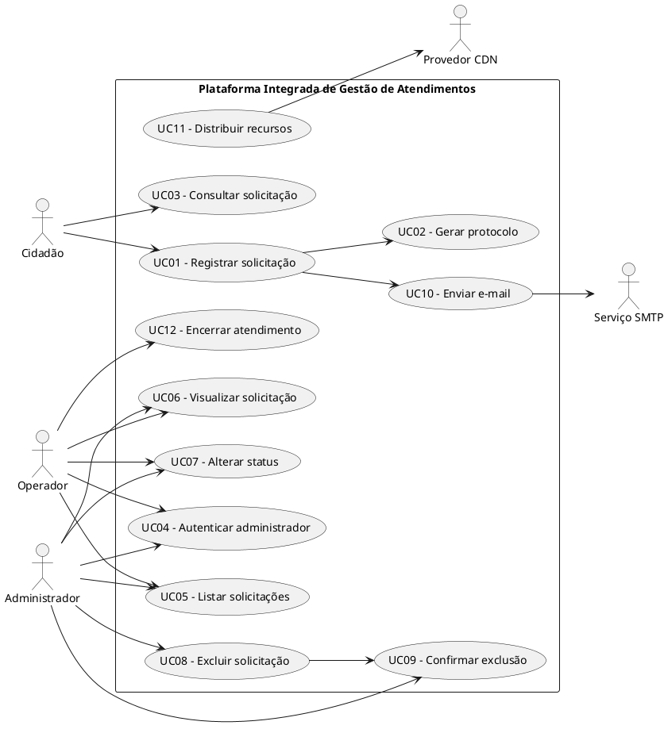
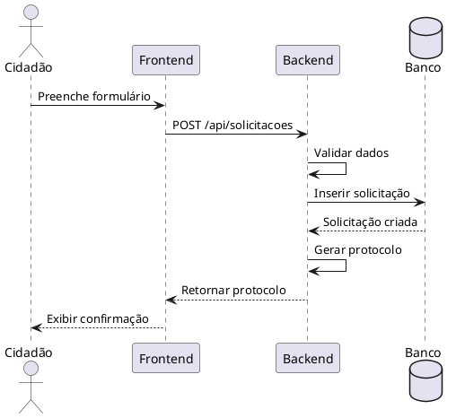
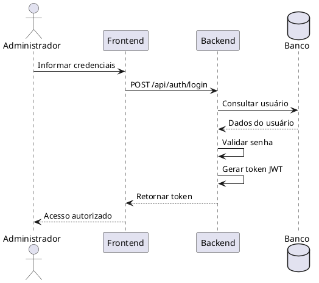
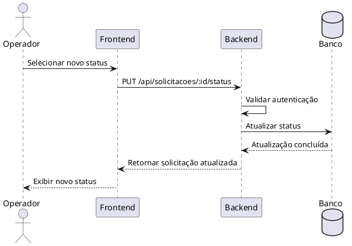
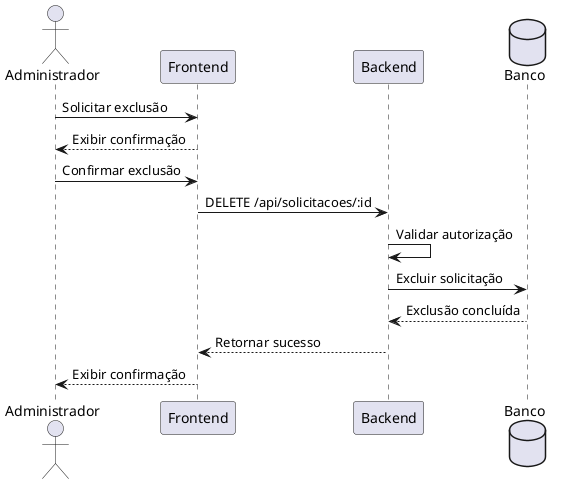

# Especificação de Requisitos de Usuário (ERU)

## Plataforma Integrada de Gestão de Atendimentos

**Versão:** 1.0.0
**Data:** 08 de setembro de 2026
**Base:** ISO/IEC/IEEE 29148:2018
**Modelagem:** UML 2.5.1

---

## 1. Introdução

### 1.1 Objetivo

Este documento apresenta os requisitos de usuário da **Plataforma Integrada de Gestão de Atendimentos**, descrevendo as funcionalidades esperadas pelos usuários e os principais comportamentos do sistema.

O documento serve como referência para desenvolvimento, validação, testes e manutenção da plataforma.

### 1.2 Escopo

A plataforma tem como objetivo permitir que cidadãos realizem solicitações de atendimento e acompanhem seus protocolos, enquanto operadores e administradores podem gerenciar, atualizar e concluir essas solicitações.

O sistema deverá oferecer:

* Cadastro público de solicitações;
* Geração de protocolo;
* Consulta de solicitações;
* Autenticação administrativa;
* Gerenciamento das solicitações;
* Alteração de status;
* Exclusão segura de registros;
* Controle de acesso;
* Registro e organização das informações.

---

# 2. Atores do Sistema

| Ator              | Descrição                                                            |
| ----------------- | -------------------------------------------------------------------- |
| **Cidadão**       | Usuário responsável por registrar e acompanhar solicitações.         |
| **Operador**      | Usuário responsável pelo atendimento e atualização das solicitações. |
| **Administrador** | Usuário com permissões administrativas sobre o sistema.              |
| **Serviço SMTP**  | Serviço externo utilizado para envio de mensagens por e-mail.        |
| **Provedor CDN**  | Serviço externo responsável pela distribuição de recursos estáticos. |

---

# 3. Casos de Uso



---

# 4. Requisitos de Usuário

## RU-01 — Registro público de solicitação

### Descrição

O sistema deverá permitir que qualquer cidadão registre uma solicitação através de um formulário público.

### Informações mínimas

O formulário deverá permitir o preenchimento de:

* Nome;
* E-mail;
* Telefone;
* Assunto;
* Descrição da solicitação;
* Categoria;
* Outros dados necessários ao atendimento.

### Regras

1. Os campos obrigatórios deverão ser validados.
2. O sistema deverá impedir o envio de dados inválidos.
3. Após o cadastro, deverá ser gerado um protocolo único.
4. A solicitação deverá receber inicialmente o status `PENDENTE`.
5. O cidadão deverá receber confirmação do registro.
6. Os dados deverão ser armazenados no banco de dados.

### Critério de aceitação

**Dado** que o cidadão preenche corretamente o formulário,
**quando** enviar a solicitação,
**então** o sistema deverá registrar o atendimento e apresentar um protocolo único.

---

# 5. RU-02 — Autenticação administrativa

### Descrição

O sistema deverá permitir que operadores e administradores autenticados acessem a área administrativa.

### Regras

1. O acesso administrativo deverá exigir autenticação.
2. As credenciais deverão ser protegidas.
3. Senhas não deverão ser armazenadas em texto puro.
4. O sistema deverá utilizar autenticação baseada em token.
5. Usuários sem autorização não poderão acessar recursos administrativos.
6. O sistema deverá diferenciar permissões de usuários quando necessário.

### Critério de aceitação

**Dado** que o usuário possui credenciais válidas,
**quando** realizar o login,
**então** o sistema deverá autenticar o usuário e permitir o acesso aos recursos autorizados.

---

# 6. RU-03 — Alteração de status

### Descrição

O operador ou administrador deverá poder alterar o status de uma solicitação durante o processo de atendimento.

### Status disponíveis

* `PENDENTE`
* `EM_ANALISE`
* `EM_ANDAMENTO`
* `CONCLUIDO`
* `INDEFERIDO`

### Regras

1. A alteração deverá ser realizada somente por usuário autorizado.
2. O novo status deverá ser válido.
3. O sistema deverá registrar a alteração.
4. O cidadão deverá conseguir consultar o status atualizado.
5. O atendimento poderá ser encerrado quando atingir um estado final.

### Critério de aceitação

**Dado** que existe uma solicitação registrada,
**quando** um operador autorizado alterar seu status,
**então** o sistema deverá salvar o novo status e disponibilizá-lo na consulta.

---

# 7. RU-04 — Exclusão segura de solicitação

### Descrição

O sistema deverá permitir a exclusão de solicitações somente para usuários com permissão administrativa.

A exclusão deverá possuir uma etapa adicional de confirmação para evitar remoções acidentais.

### Regras

1. Somente administradores poderão excluir solicitações.
2. O sistema deverá apresentar uma confirmação antes da exclusão.
3. A exclusão deverá exigir uma segunda ação explícita.
4. Após a confirmação, o registro deverá ser removido.
5. Usuários sem permissão não poderão executar a operação.

### Critério de aceitação

**Dado** que um administrador deseja excluir uma solicitação,
**quando** selecionar a opção de exclusão,
**então** o sistema deverá apresentar uma confirmação.

**E quando** o administrador confirmar novamente,
**então** o sistema deverá excluir a solicitação.

---

# 8. Histórias de Usuário

## US-01 — Registrar solicitação

**Como** cidadão,
**quero** registrar uma solicitação pela plataforma,
**para** obter atendimento e acompanhar minha demanda.

### Cenário

```gherkin
Funcionalidade: Registro de solicitação

Cenário: Cadastro realizado com sucesso
  Dado que o cidadão está na página de solicitação
  E preenche todos os campos obrigatórios
  Quando enviar o formulário
  Então o sistema deve registrar a solicitação
  E gerar um protocolo único
  E definir o status como "PENDENTE"
```

---

## US-02 — Atualizar status

**Como** operador,
**quero** alterar o status de uma solicitação,
**para** manter o cidadão informado sobre o andamento do atendimento.

### Cenário

```gherkin
Funcionalidade: Atualização de status

Cenário: Alteração de status realizada
  Dado que o operador está autenticado
  E existe uma solicitação cadastrada
  Quando alterar o status da solicitação
  Então o sistema deve salvar o novo status
  E disponibilizar a informação para consulta
```

---

## US-03 — Excluir solicitação

**Como** administrador,
**quero** excluir uma solicitação,
**para** remover registros que não devem permanecer no sistema.

### Cenário

```gherkin
Funcionalidade: Exclusão de solicitação

Cenário: Exclusão confirmada
  Dado que o administrador está autenticado
  E possui permissão para excluir
  Quando solicitar a exclusão
  Então o sistema deve apresentar uma confirmação
  E quando o administrador confirmar novamente
  Então a solicitação deve ser removida
```

---

# 9. Diagramas de Sequência

## DS01 — Registro de solicitação



---

## DS02 — Autenticação



---

## DS03 — Alteração de status



---

## DS04 — Exclusão segura



---

# 10. Requisitos de Segurança

A plataforma deverá:

1. Utilizar autenticação segura;
2. Utilizar autorização baseada em permissões;
3. Armazenar senhas utilizando funções de hash seguras;
4. Utilizar tokens de autenticação com validade definida;
5. Validar dados recebidos pelo servidor;
6. Evitar exposição de informações sensíveis;
7. Proteger endpoints administrativos;
8. Impedir acesso não autorizado;
9. Utilizar variáveis de ambiente para informações sensíveis;
10. Registrar operações administrativas relevantes.

---

# 11. Requisitos de Usabilidade

O sistema deverá:

* Apresentar interface simples e intuitiva;
* Possuir mensagens claras de erro;
* Informar o resultado das operações;
* Permitir navegação fácil;
* Possuir formulários organizados;
* Apresentar informações de forma legível;
* Ser compatível com dispositivos desktop e mobile.

---

# 12. Requisitos de Desempenho

O sistema deverá:

1. Responder às operações comuns em tempo adequado;
2. Evitar consultas desnecessárias ao banco;
3. Utilizar paginação quando houver grande quantidade de registros;
4. Manter o servidor estável durante operações simultâneas;
5. Evitar processamento excessivo no frontend.

---

# 13. Rastreabilidade

| Requisito | Caso de Uso | História de Usuário |
| --------- | ----------- | ------------------- |
| RU-01     | UC01 / UC02 | US-01               |
| RU-02     | UC04        | US-02               |
| RU-03     | UC07        | US-02               |
| RU-04     | UC08 / UC09 | US-03               |

---

# 14. Tecnologias Previstas

### Backend

* Node.js
* Express
* SQLite
* PostgreSQL
* JWT

### Frontend

* HTML5
* CSS3
* JavaScript
* Vanilla JavaScript

### Documentação

* UML 2.5.1
* PlantUML
* ISO/IEC/IEEE 29148:2018

---

# 15. Considerações Finais

Este documento define os principais requisitos de usuário da Plataforma Integrada de Gestão de Atendimentos.

Os requisitos apresentados deverão servir como referência para implementação, testes, validação e evolução do sistema.

Alterações futuras deverão ser documentadas e avaliadas para garantir que não comprometam os requisitos existentes, a segurança da aplicação ou a experiência dos usuários.

**Versão do documento:** 1.0.0
**Data:** 08/09/2026
